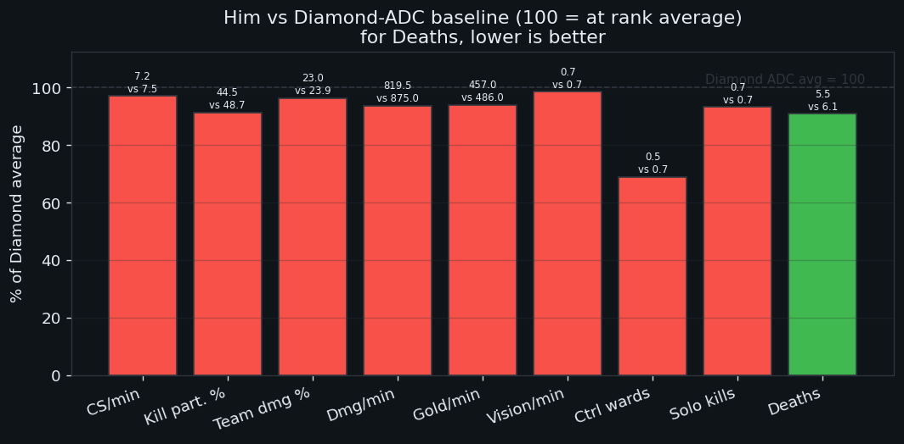
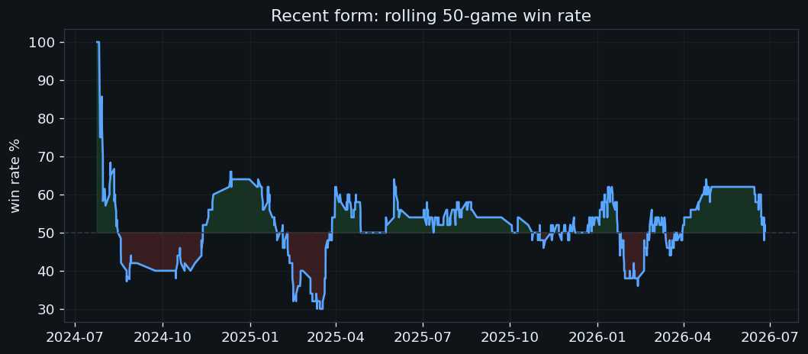
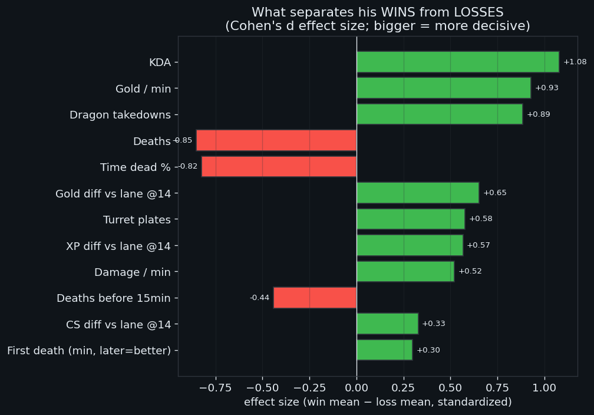
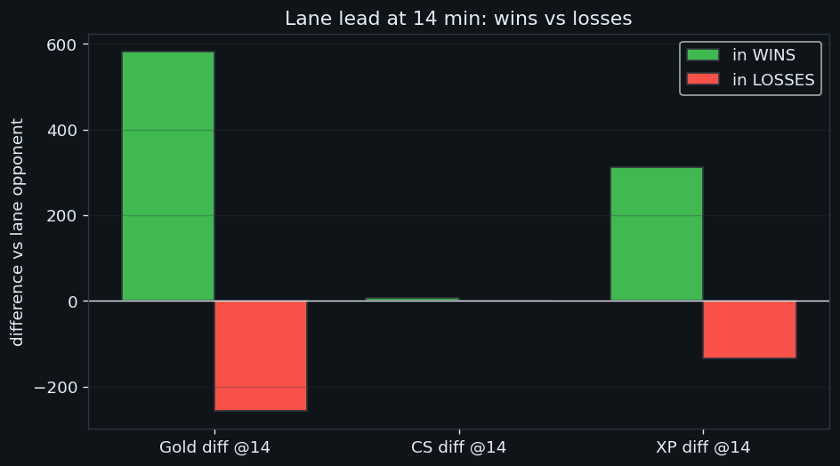
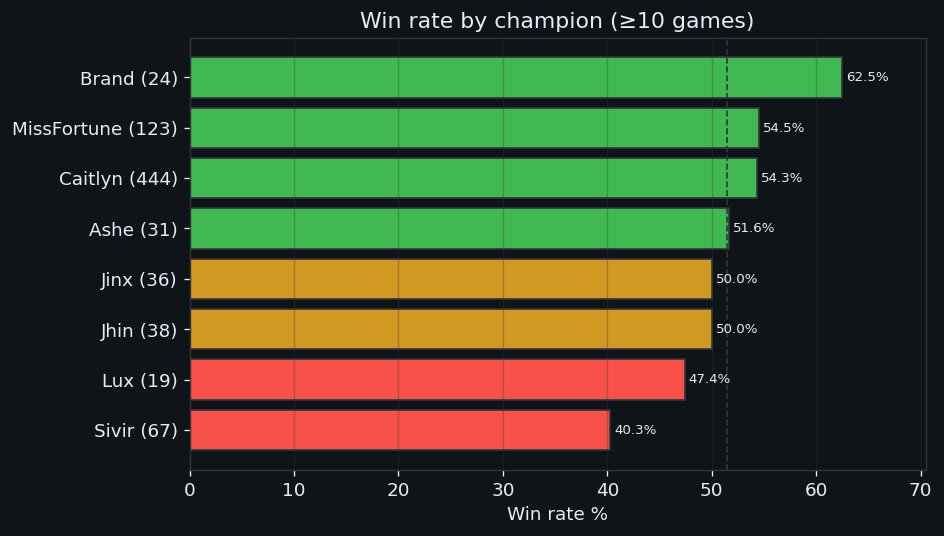
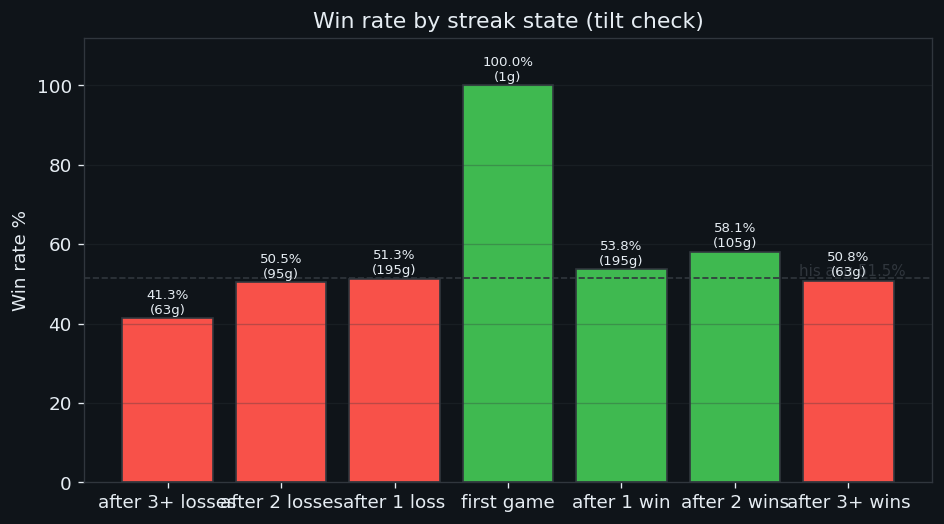
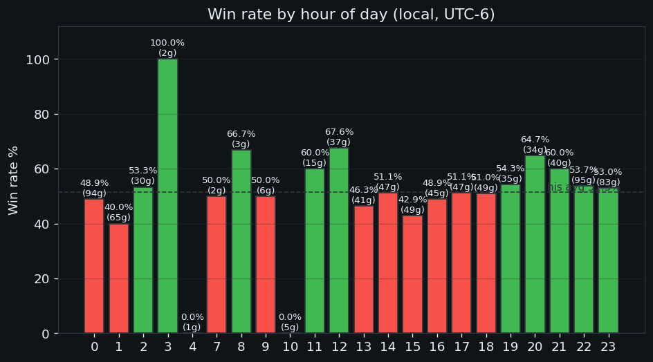
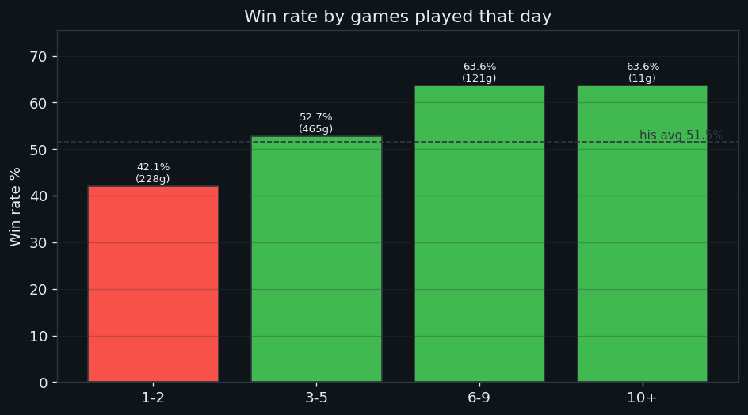

# Topcheese044 — Solo Queue Coaching Report

**Account:** `Topcheese044#NA1` (NA) · **Rank at pull:** Diamond III, 84 LP
**Sample:** 825 ranked-solo games, 24 Jul 2024 → 25 Jun 2026 · **Overall: 51.5% WR** (425–400)
**Role:** ADC (761 of 825 games bottom lane) · **Champions:** 22 played, heavily Caitlyn-weighted

> Every number below comes from his own match + timeline data, benchmarked against a
> 194-game sample of real Diamond ADCs we pulled from the ladder. Methodology at the end.

---

## TL;DR — the 5 highest-leverage changes

1. **Bench Sivir.** 40.3% over **67 games** — his worst-by-far high-volume champ, ~13 points below his average. Those games alone cost him an estimated **~9 wins**. ([details](#4-champion-pool))
2. **Stop queuing after 3 losses, and stop at midnight.** WR craters to **41.3% after 3+ losses** and to **40–49% after midnight** (159 games). His evening window (8–9 PM) is **60–65%**. ([details](#6-tilt--scheduling))
3. **Play for objectives, not just lane.** The single biggest skill gap between his wins and losses is **dragon participation** (1.28 in wins vs 0.48 in losses) and **gold generation** — bigger than laning itself. ([details](#3-what-actually-decides-his-games))
4. **Match-pick his main.** Caitlyn is **64% into Jhin** and **78% into Twitch**, but **33% into Sivir / 40% into Kai'Sa / 48% into Jinx**. Into those, pick **Miss Fortune** (54.5%, +584 gold@14) instead. ([details](#4-champion-pool))
5. **Cut the early deaths.** He gives up a death before 10 min in **68% of games** (avg first death **7.7 min**). Fewer early deaths is a clear win-marker. ([details](#5-early-game--deaths))

---

## 1. The diagnosis: a safe, clean farmer who under-converts

Benchmarked against Diamond ADCs, he is **remarkably average on nearly everything, with one consistent shape**: he plays *safe and clean* but generates *less impact*.

| | Him | Diamond ADC avg | Read |
|---|---|---|---|
| Deaths / game | **5.5** | 6.1 | ✅ dies less |
| CS diff vs lane @14 | **+5.1** | +1.6 | ✅ out-farms his laner |
| CS / min | 7.3 | 7.5 | ≈ par |
| Kill participation | 45.3% | 48.7% | 🚩 under-involved |
| Damage / min | 820 | 875 | 🚩 lower output |
| Gold / min | 457 | 486 | 🚩 lower |
| **Control wards / game** | **0.45** | 0.71 | 🚩 buys ~⅓ fewer |

**Interpretation:** he wins his lane on CS and avoids dying — but converts that into fewer fights, less damage, less gold, and less map/objective pressure than his peers. He is not losing because of mechanics or farming. **He is losing because lane leads aren't being turned into team impact.** That's good news: it's a decision-making problem, which climbs faster than a mechanics problem.

---

## 2. Where he stands

- **51.5% lifetime WR** is consistent with someone correctly placed around Diamond — he is at his MMR, not stuck below it.
- Rolling form has oscillated around 50% for two years (see chart) — he has **plateaued**, which is exactly what you'd expect from an average-everything profile. Breaking the plateau means raising the metrics flagged 🚩 above.

---

## 3. What actually decides his games

Comparing every metric in his **wins vs his losses** (standardized effect size — bigger bar = more decisive):

Ignoring KDA (which is just a scoreboard echo of winning), the **real, controllable** differentiators are:

| Differentiator | In wins | In losses | Takeaway |
|---|---|---|---|
| **Gold / min** | 493 | 419 | Wins = he snowballs gold. Group & take objectives to keep earning. |
| **Dragon takedowns** | 1.28 | 0.48 | **Be present for drakes.** This is the clearest behavioral lever. |
| **Deaths** | 4.4 | 6.7 | Deaths swing games hard — every avoided death matters. |
| **Time spent dead** | 7.0% | 10.4% | Same story: respawn timers in losses are brutal. |
| **Gold/XP diff @14** | +582 / +312 | −257 / −134 | Lane leads matter, but **less than objectives/deaths**. |
| **Turret plates** | 5.4 | 2.6 | Convert early leads into plates → gold → snowball. |

**The headline:** for this player, *objective presence and gold conversion outrank laning*. He already wins lane on CS; the leak is **not grouping for dragons and not translating leads into gold/plates/kills**.

---

## 4. Champion pool

| Champion | Games | WR | Gold@14 | Dmg% | Verdict |
|---|---|---|---|---|---|
| **Miss Fortune** | 123 | **54.5%** | **+584** | 24.8 | ⭐ **Best champ. Play more.** Dominant early. |
| **Caitlyn** | 444 | 54.3% | +264 | 23.6 | ✅ Solid main — but matchup-dependent (below). |
| Jhin | 38 | 50.0% | +402 | 19.3 | ⚪ OK but low damage share. |
| Jinx | 36 | 50.0% | −631 | 23.7 | ⚠️ Gets crushed early (−631!), relies on scaling. |
| Ashe | 31 | 51.6% | −117 | 17.9 | ⚪ Utility pick, fine. |
| **Brand** | 24 | **62.5%** | — | 21.7 | 💡 Niche bright spot (likely sup/mid) — keep as pocket pick. |
| **Sivir** | **67** | **40.3%** | −114 | 22.7 | ❌ **BENCH.** Farms well (8.1 cs/min) but loses. Biggest leak. |
| Kai'Sa | 9 | 22.2% | −1024 | 22.4 | ❌ Avoid — gets stomped early. |
| Tristana | 7 | 28.6% | — | 19.5 | ❌ Avoid. |

**The Sivir problem.** She has his *best* CS/min yet his *worst* win rate — a textbook sign of a champion he farms on but can't carry with. Replacing 67 Sivir games with his ~53% champs is worth roughly **+9 wins** — about two full divisions of LP over this sample.

### Caitlyn matchup map (his 444-game main)

Caitlyn's win rate swings massively by enemy ADC — **pick her on purpose, not on autopilot**:

| ✅ First-pick / blind Caitlyn into | WR | ❌ Do NOT pick Caitlyn into | WR |
|---|---|---|---|
| Twitch (9g) | 78% | **Sivir (15g)** | **33%** |
| Draven (13g) | 69% | Zeri / Xayah / Ziggs (8g ea) | ~38% |
| Aphelios (17g) | 65% | **Kai'Sa (25g)** | **40%** |
| Jhin (56g) | 64% | Tristana (14g) | 43% |
| Ezreal (27g) / Samira (11g) | 63–64% | **Jinx (46g)** | **48%** |

**Rule of thumb:** Caitlyn dominates immobile lane bullies she out-ranges (Jhin, Draven, Twitch, Aphelios). She loses to scaling/all-in carries that survive her early game (Kai'Sa, Jinx, Sivir, Zeri). **Into those, lock Miss Fortune.**

### Enemy ADCs that beat him regardless of his pick

His lowest win rates by opponent: **Seraphine 0% (6g)**, Ziggs 33%, **Zeri 36%**, Tristana 39%, Sivir 40%, Lucian 41%, Twitch 42%. These are poke/scaling lanes and early bullies — flag them in champ select and **play safe-to-scale** rather than forcing trades.

---

## 5. Early game & deaths

Despite a low overall death count, the early game is leaky:

- **Average first death: 7.7 minutes** — he's typically the first bot-laner to die.
- **68% of games include a death before 10 minutes.**
- Deaths before 15 min is a measurable win/loss differentiator.

This squares with the profile: he plays safe *overall* but takes a **bad early trade/gank** in most games, conceding tempo and lane priority even when he's CSing fine. **Fixing early positioning (ward the lane brush, respect the level-2/6 power spikes, don't overstay for the last few CS) is a concrete, trackable goal.**

---

## 6. Tilt & scheduling

He plays **short sessions** (avg 2.5 games) — and *when* he plays matters as much as how.

- **After 3+ losses: 41.3%** (63 games) — by far his worst state. **Hard rule: 3 losses → log off.** Continuing is statistically a losing proposition.
- After 2 wins: 58.1% — he plays well with momentum; **ride hot streaks.**

- **Best window: 8–9 PM local (60–65%).** This is when to grind ranked.
- **Worst window: midnight–1 AM (40–49% across 159 games).** His single most-played hour is midnight — and it's below 50%. **Stop queuing ranked after midnight**; play normals or log off.
- Afternoon (3 PM) also dips to ~43%.

- WR is *higher* on high-volume days (3–9 games) than on 1–2 game days (42%). **Caveat:** this is partly reverse-causation — losing early makes him quit, so bad days look like "short" days. The honest read isn't "play more," it's "**don't queue a single cold game late at night** and **warm up** before laddering."

*(Local time inferred from his activity pattern as UTC−6 / US Central — see methodology.)*

---

## 7. The action plan

**This week (behavioral, trackable):**
1. ❌ **Remove Sivir** from the ranked pool. Default to Caitlyn / Miss Fortune.
2. 🐉 **Rotate to every dragon** with 30s+ of spawn warning — target 1.3 dragon takedowns/game (his win-rate level).
3. 🛑 **Two hard stops:** log off after 3 losses; no ranked after midnight.
4. 🎯 **Ward the lane bushes by 2:30** and avoid the pre-10-min death — aim to cut early-death games from 68% toward 50%.

**This month (habit):**
5. 🔀 **Counter-pick discipline:** Caitlyn only into her good matchups; Miss Fortune into Kai'Sa/Jinx/Sivir/Zeri.
6. 💰 **Convert leads:** when ahead at 14 min, group for plates + dragon instead of farming side lane — turn the CS lead into gold/objectives (his win-defining metric).
7. 👁️ **Buy a control ward every back** (he averages 0.45/game vs 0.71 for peers).
8. ⏰ **Ladder in the 8–9 PM window** when possible.

**Expected impact:** the Sivir cut + matchup discipline + the two scheduling rules each independently target 5–13 point WR swings on meaningful samples. Even partial adoption should move him from 51.5% toward 54–55% — enough to climb out of Diamond III.

---

## 8. Methodology & caveats

- **Data:** all 825 ranked-solo games + frame-by-frame timelines pulled from the Riot Match-V5 API (history reaches ~Jul 2024). Metrics use Riot's own `challenges` fields plus timeline-derived lane diffs at 10/14 min vs his direct opponent.
- **Benchmark:** 194 ADC performances sampled from 120 Diamond-ladder players' recent solo games — a real peer baseline, not published/aspirational numbers.
- **Effect size** = Cohen's d (standardized win-mean − loss-mean); it ranks *how decisively* a metric differs, not causation.
- **Caveats:** (1) KDA/gold correlate with winning by definition — excluded from "actionable." (2) Small-sample champs/matchups (<10 games) are directional only. (3) Games-per-day WR is confounded by quit-after-loss behavior. (4) Local time is inferred, not from his client. (5) Patch/meta shifts over a 2-year window aren't normalized.
- **Reproduce:** `python fetch.py && python benchmark_fetch.py && python analyze.py && python charts.py`.
